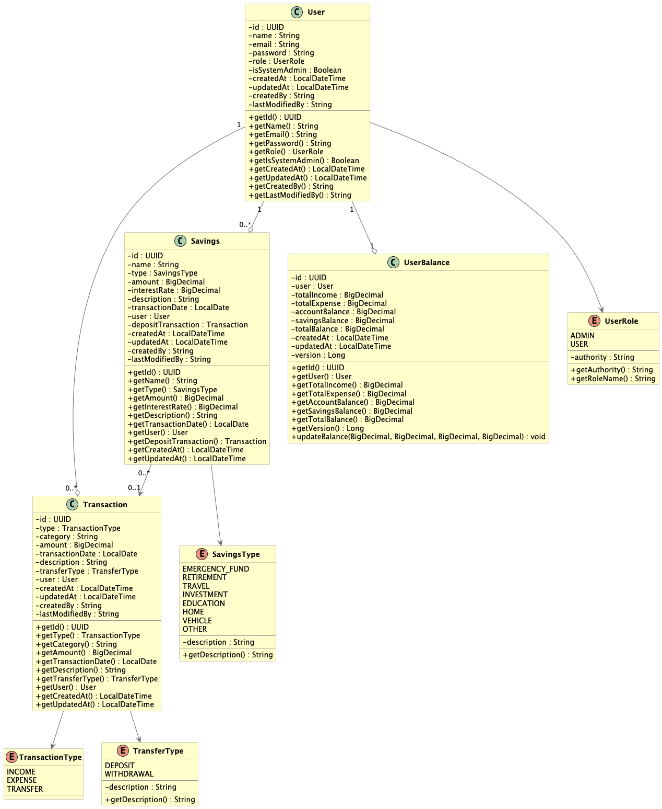
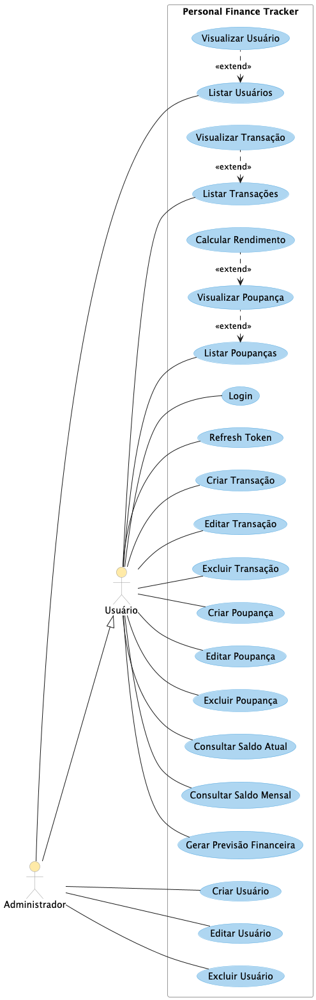

# Personal Finance Tracker API

Sistema de gerenciamento financeiro pessoal com autenticação JWT, controle de despesas e receitas, categorias personalizadas e relatórios financeiros.

[](https://sonarcloud.io/summary/new_code?id=heimydias_personal-finance-tracker)
[](https://sonarcloud.io/summary/new_code?id=heimydias_personal-finance-tracker)
[](https://sonarcloud.io/summary/new_code?id=heimydias_personal-finance-tracker)
[](https://sonarcloud.io/summary/new_code?id=heimydias_personal-finance-tracker)
[](https://sonarcloud.io/summary/new_code?id=heimydias_personal-finance-tracker)
[](https://sonarcloud.io/summary/new_code?id=heimydias_personal-finance-tracker)
[](https://sonarcloud.io/summary/new_code?id=heimydias_personal-finance-tracker)
[](https://sonarcloud.io/summary/new_code?id=heimydias_personal-finance-tracker)
[](https://sonarcloud.io/summary/new_code?id=heimydias_personal-finance-tracker)
[](https://sonarcloud.io/summary/new_code?id=heimydias_personal-finance-tracker)
[](https://sonarcloud.io/summary/new_code?id=heimydias_personal-finance-tracker)

## Sumário

- [Arquitetura](#arquitetura)
- [Funcionalidades](#funcionalidades)
- [Tecnologias](#tecnologias)
- [Frontend](#frontend)
- [Swagger](#swagger)
- [Requisitos](#requisitos)
- [Configuração](#configuração)
- [Execução](#execução)
- [Diagramas](#diagramas)
- [Contato](#contato)

## Arquitetura


A aplicação segue uma arquitetura de microserviços com três componentes principais:
- **Frontend (React):** Interface de usuário desenvolvida em React
- **Backend (Spring Boot):** API REST com autenticação JWT
- **Database (MySQL):** Banco de dados relacional para persistência

## Funcionalidades

### Autenticação e Autorização
- Autenticação JWT com Spring Security
- Perfis de usuário (Admin/User)
- Controle de acesso baseado em roles

### Gestão de Transações
- Registro de receitas e despesas
- Transferências para poupança
- Categorização de transações
- Histórico completo de movimentações

### Gestão de Poupanças
- Criação de metas de poupança
- Diferentes tipos (emergência, aposentadoria, viagem, etc.)
- Cálculo automático de rendimentos

### Consultas e Relatórios
- Saldo atual da conta
- Saldo mensal detalhado
- Previsão financeira baseada em histórico

## Tecnologias

### Core
- Java 21
- Spring Boot 3.5.5
- Spring Security
- Spring Data JPA
- Maven 3.6+

### Banco de Dados
- MySQL 8.0
- Flyway (migrations)

### Documentação
- OpenAPI 3.0 (Swagger)
- Swagger UI

### Testes
- JUnit 5
- TestContainers
- Spring Boot Test

### DevOps
- Docker
- Docker Compose

## Frontend

### Acesso
- **URL:** [http://localhost:3000](http://localhost:3000)

### Funcionalidades Atuais

#### Tela de Login
- Autenticação de usuários com email e senha
- Validação de formulários
- Mensagens de erro personalizadas
- Redirecionamento após login bem-sucedido

#### Tela de Registro
- Cadastro de novos usuários
- Validação de campos obrigatórios
- Confirmação de senha
- Integração com backend para criação de conta

#### Dashboard
- Visão geral das finanças pessoais
- Resumo de receitas e despesas
- Gráficos e indicadores financeiros

### Tecnologias do Frontend
- React 19
- Vite 7
- React Router 7
- Axios para requisições HTTP
- Context API para gerenciamento de estado

## Swagger

- **OpenAPI UI:** [http://localhost:8080/personal-finance-tracker/swagger-ui/index.html](http://localhost:8080/personal-finance-tracker/swagger-ui/index.html)
- **API Docs:** [http://localhost:8080/personal-finance-tracker/v3/api-docs](http://localhost:8080/personal-finance-tracker/v3/api-docs)

## Requisitos

- JDK 21
- Maven 3.6+
- Docker

## Configuração

**Instalação do JDK, Maven e Docker:**

- [Instruções para instalação do JDK](https://docs.oracle.com/en/java/javase/21/install/overview-jdk-installation.html)
- [Instruções para instalação do Maven](https://maven.apache.org/install.html)
- [Instruções para instalação do Docker](https://docs.docker.com/get-docker/)

## Execução

Copie as variáveis utilizadas

```bash
cp example.env .env
```

Execute o comando abaixo:

```bash
docker-compose up -d
```

### Autenticação

Após a inicialização da aplicação, um usuário administrador padrão é criado automaticamente.

**Credenciais padrão:**
- **Email:** admin@admin.com
- **Senha:** admin123

**Para usar a API:**

1. **Fazer login:** Use o endpoint `/auth/login` com as credenciais padrão para obter o token JWT
2. **Usar token:** Adicione o token no header `Authorization: Bearer {token}` em todas as requisições protegidas

## Diagramas

### Diagrama de Classes



### Diagrama de Casos de Uso



## Contato

Para suporte ou feedback:

- **Nome:** Heimy Dias
- **Email:**  [heimysantana@hotmail.com](mailto:heimysantana@hotmail.com)
- **LinkedIn:** [https://linkedin.com/in/heimydias](https://linkedin.com/in/heimydias)